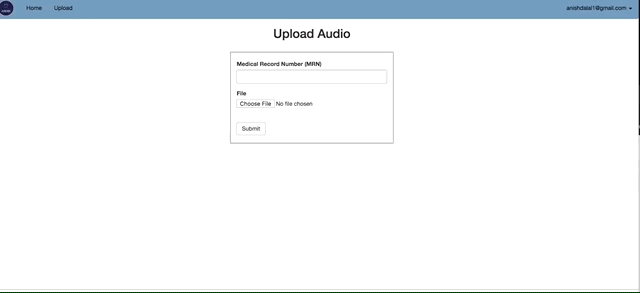

# ARMR

The Electronic Medical Record (EMR) is patient-specific health care information used by hospitals, clinics, and medical practices to store and retrieve medical data on individual patients.  Historically, physicians provided this information with handwritten notes or telephone dictation, however, this has since been largely replaced by the more uniform, thorough, timely, and legible benefits of an EMR. While the large price tag for these EMR systems has been absorbed by hospitals, clinics, and physicians, the time required to use this new tool has been less well received. It is well-established that physicians who use these systems are less efficient with their time and consequently see fewer patients. Even more troublesome than the time-consuming burden of navigating through an EMR and inputting the data is the way the physician-patient interaction is affected by this new tool. With ARMR (Audio Recorded Medical Online Record), verbal dictation and machine learning capture unstructured audio dictation data and structure it so can be uploaded to an EMR system.

## Demo

Here's a GIF that demonstrates the workflow. It's quite simple. Just do the folowing:

1. upload a .wav file
2. view the diseases and drugs that were mentioned in the audio
3. Repeat 1 and 2 

You can download and listen to the file example.wav used for the demo. You will hear expressions such as "history of present illness" and "medications prior to admission". As of now, ARMR needs to hear the names of certain phrases that help create sections in the results report as the demo shows. You will also hear the word "period" to actual have punctuation in the transcription. This is a limitation of ARMR but can be overcome with more sophisticated Speech-to-Text APIs such as Google's (https://cloud.google.com/speech-to-text/). 

## Getting Started

follow instructions here https://msds698.github.io/ARMR/tutorial.html#tutorial-for-using-armr

## Prerequisites

Server Requirements: https://msds698.github.io/ARMR/requirements.html

## Installing

Installation Steps: https://msds698.github.io/ARMR/tutorial.html

## Built With

* [Spacy](https://spacy.io/) - Used for Named Entity Recognition
* [Flask](http://flask.pocoo.org/) - Web Server
* [SpeechRecognizer](https://pypi.org/project/SpeechRecognition/) - Speech-to-Text API
* [Boostrap](https://getbootstrap.com/) - Frontend CSS

## Authors

Anish Dalal, Nicole Kacirek, Sarah Melancon, Darren Thomas, and Tyler Ursuy
